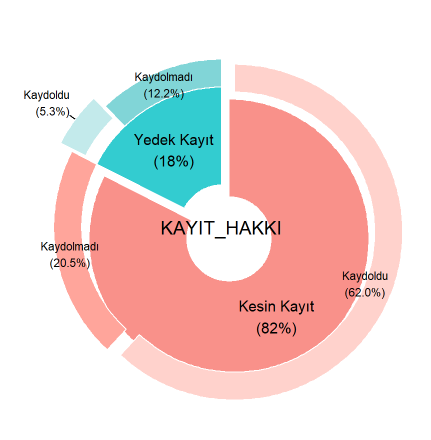

```{r setup, include=FALSE}
knitr::opts_chunk$set(echo = TRUE)
```

```{r message=FALSE, warning=FALSE, include=FALSE}
library(readxl)
library(plotly)
library(dplyr)
library(ggplot2)
basvuru  <- read_excel("basvuru_v5.xlsx")

UNI_ad <- strsplit(basvuru$Mezun_Oldugu_Okul, "ÜNİVERSİTESİ" )
Mezun_Uni <- unlist(lapply(UNI_ad, function(x)x[[1]]))
basvuru <- mutate(basvuru,Mezun_Uni)


Uyruk_1 <- basvuru %>%
  filter(Uyruk!="T.C.") %>%
  group_by(Uyruk) %>%
  summarise(toplam = n()) %>%
  mutate(yuzde = round(toplam/sum(toplam),3)) %>% arrange(-toplam)

Kazanan <- basvuru %>%
  filter(Kayit_Hakki!="Kayıt Hakkı Kazanamadı")

Kayit <- Kazanan %>%
  group_by(Kayit_Hakki,Kayit_Oldu_Mu) %>%
  summarise(toplam = n(), .groups = 'drop')  %>%
  rename(KAYIT_HAKKI = Kayit_Hakki) %>%
  mutate(KAYIT_HAKKI=recode(KAYIT_HAKKI,
                            `Kesin Kayıt Hakkı Kazandı`="Kesin Kayıt",
                            `Yedek Kayıt Hakkı Kazandı`="Yedek Kayıt",)) %>%
  rename(k2 = Kayit_Oldu_Mu)


Kayıtlı <- Kazanan %>%
  filter(Kayit_Oldu_Mu=="Kaydoldu")
```

Bu rapor, Hacettepe Üniversitesi Eğitim Bilimleri Enstitüsü tarafından 2023 yılında hazırlanmıştır. Elinizdeki bu raporun temel amacı, 2015-2023 yılları arasında üniversitemize lisansüstü eğitim amacıyla katılan öğrencilerin profilini ortaya koymaktır. Rapor, dijital veri tabanından elde edilen yaklaşık 13825 kişinin verinin analizi ile oluşturulmuştur.

## Aday Öğrenci Uyrukları

Enstitümüze lisansüstü eğitim için başvuran öğrencilerin %99,29'u Türkiye Cumhuriyeti vatandaşıdır. Oldukça küçük bir kısmı, Azerbaycan, İran, Türkmenistan, Almanya ve Kuzey Kıbrıs Türk Cumhuriyeti vatandaşıdır. Enstitümüze en fazla başvuruda bulunan 10 ülkenin görselleştirilmesi Şekil 1'de yer almaktadır.

```{r echo=FALSE,message=FALSE, warning=FALSE}

plot_ly(Uyruk_1[1:10,]) %>%
  add_pie(Uyruk_1[1:10,], labels = ~`Uyruk`, values = ~`toplam`,
          type = 'pie', hole = 0.5)

```

**Şekil 1.** Aday Öğrenci Uyruk Dağılımı

## Kayıt Hakkı Kazanan Öğrenciler

Enstitüye , 2015-2023 yılları arasında başvuran 13825 aday öğrencinin 3537 kesin kayıt hakkı, 753 yedek kayıt hakkı kazanmıştır.

```{r echo=FALSE,message=FALSE, warning=FALSE}
library(webr)
# PieDonut(Kayit, aes(KAYIT_HAKKI,k2,count=toplam ),
#                explode=1.2,
#                explodeDonut=TRUE,selected=c(1,3),
#                ratioByGroup=FALSE)  +theme(panel.border = element_blank())
```


 
**Şekil 2.** Kayıt Hakkı Kazanan Öğrencilerin Kayıt Durumu

Kesin kayıt hakkı kazanan öğrencilerin %62'si yedek kayıt hakkı kazanan öğrencilerin ise %5.3'ü kayıt yaptırmıştır.

## Kayıtlı Öğrenciler {.tabset}

### Cinsiyet

Öğrencilerin %74.5'i kadın, %25.5'i erkektir.

```{r echo=FALSE,message=FALSE, warning=FALSE}

tp <- Kayıtlı %>% group_by(YIL) %>% 
  summarise(toplam = n(), .groups = 'drop')

tp2 <- rep(tp$toplam,each=2)
Cinsiyet <- Kayıtlı %>% group_by(YIL,Cinsiyet) %>% 
  summarise(toplam = n(), .groups = 'drop')  %>% 
  mutate(tp2=tp2) %>% mutate(oran=toplam   / tp2)

plot_ly(Cinsiyet) %>%
add_pie(Cinsiyet, labels = ~`Cinsiyet`, values = ~`toplam`,
          type = 'pie', hole = 0.5,
         marker = list(colors = c("1" =  "#4285F4",
                                 "2" = "#B76C9E")))
Cinsiyet$Cinsiyet <- as.factor(Cinsiyet$Cinsiyet )
Cinsiyet$YIL <- as.factor(Cinsiyet$YIL )

 ggplot(data=Cinsiyet, aes(x=" ", y=oran, group=Cinsiyet, fill=Cinsiyet)) +
         geom_bar(width = 1, stat = "identity") +
         coord_polar("y") + 
         facet_grid(.~ YIL) +theme_void() +
            scale_color_manual(values=c("#4285F4", "#B76C9E"))+
            scale_fill_manual(values=c("#4285F4", "#B76C9E"))

```

### Öğrenim Düzeyi

Öğrencilerin %45,1'i yüksek lisans , %25,9'u doktora ,%14,6'sı tezsiz yüksek lisans, ,%13,7'si uzaktan tezsiz yüksek lisans ve %0,76'sı bütünleşik doktora programındadır.

```{r echo=FALSE,message=FALSE, warning=FALSE}
Kayıtlı_duzey <- Kayıtlı %>% group_by(Ogretim_Duzeyi) %>% summarise(toplam = n(), .groups = 'drop')

plot_ly(Kayıtlı_duzey) %>%
  add_pie(Kayıtlı_duzey, labels = ~`Ogretim_Duzeyi`, values = ~`toplam`,
          type = 'pie', hole = 0.5)
```


### Mezun Oldukları Okul

Öğrencilerin 100'den fazla farklı değişik üniversiteden mezun oldukları bulunmuştur. Öğrencilerin %50,4'ü Hacettepe Üniversitesinin değişik bölümlerinden mezun olduğu, bu üniversiteyi sırasıyla Orta Doğu Teknik Üniversitesi, Gazi Üniversitesi, Anadolu Üniversitesi, Ankara Üniversitesi, Başkent Üniversitesi ve Dokuz Eylül Üniversitesi'nin izlediği tespit edilmiştir.


```{r echo=FALSE,message=FALSE, warning=FALSE}
Kayıtlı_Uni <- Kayıtlı %>% group_by(Mezun_Uni) %>% summarise(toplam = n(), .groups = 'drop') %>% arrange(-toplam)

plot_ly(Kayıtlı_Uni[1:10,]) %>%
  add_pie(Kayıtlı_Uni[1:10,], labels = ~`Mezun_Uni`, values = ~`toplam`,
          type = 'pie', hole = 0.5)
```


### Mezuniyet Derecesi

Öğrencilerin  mezuniyet derecesi ortalaması yıllara göre aşağıdaki gibi dağılmıştır.


```{r echo=FALSE,message=FALSE, warning=FALSE}
Kayıtlı_Transkript <- Kayıtlı %>% mutate(Transkript_Puan = as.numeric(Transkript_Puan))%>%
  filter(Transkript_Puan>=4) 

Kayıtlı_Transkript1 <- Kayıtlı_Transkript %>% group_by(YIL) %>% summarize(Transkript= mean(Transkript_Puan,na.rm=TRUE))

plot_ly(Kayıtlı_Transkript1,
        y=~Transkript, x=~YIL, 
        type = 'bar') %>% 
        layout(yaxis = list(title = 'Mezuniyet Derecesi'),
               yaxis = list(title = 'Öğretim Dönemleri'),
               barmode = 'stack')


```

### Ortalama ALES Puanları

Öğrencilerin  ALES ortalaması yıllara göre aşağıdaki gibi dağılmıştır.

```{r echo=FALSE,message=FALSE, warning=FALSE}
Kayıtlı_ALES <- Kayıtlı %>% mutate(ALES_Puan = as.numeric(ALES_Puan))%>%
  filter((ALES_Puan<= 100 & ALES_Puan > 0 ) )

Kayıtlı_ALES_1 <- Kayıtlı_ALES %>% group_by(YIL) %>% summarize(ALES=mean(ALES_Puan,na.rm=TRUE))

plot_ly(Kayıtlı_ALES_1,
        y=~ALES, x=~YIL, 
        type = 'bar') %>% 
        layout(yaxis = list(title = 'ALES Puanları'),
               yaxis = list(title = 'Öğretim Dönemleri'),
               barmode = 'stack')


```


### Ortalama Dil Puanları


Öğrenciler başvurları sırasından YDS, E-YDS,YOKDIL, KPDS, TOEFL ve IELTS olmak üzere farklı sınav puanlarını kullanmışlardır. En sık kullanılan üç puan türü sırası YOKDIL, YDS ve E-YDS'dir.

```{r echo=FALSE,message=FALSE, warning=FALSE}


Kayıtlı_DIL <- Kayıtlı %>% 
  filter(  Dil_Tur %in%  c("YOKDIL", "YDS" , "EYDS"))%>%
   mutate(Dil_Puan = as.numeric(Dil_Puan))


Kayıtlı_DIL1 <- Kayıtlı_DIL %>% group_by(YIL) %>% summarize(DIL= mean(Dil_Puan,na.rm=TRUE))

plot_ly(Kayıtlı_DIL1,
        y=~DIL, x=~YIL, 
        type = 'bar') %>% 
        layout(yaxis = list(title = 'DIL Puanları'),
               yaxis = list(title = 'Öğretim Dönemleri'),
               barmode = 'stack')

```

## Ana Bilim Dalları {.tabset}

### Bilgisayar ve Öğretim Teknolojileri Eğitimi

### Eğitim Bilimleri Ana Bilim Dalı

### İlköğretim Ana Bilim Dalı

### Matematik ve Fen Bilimleri Eğitimi Ana Bilim

### Ortaöğretim Fen ve Matematik Alanlar Eğitimi

### Özel Eğitim Ana Bilim Dalı

### Temel Eğitim Ana Bilim Dalı

### Türkçe Eğitimi Ana Bilim Dalı

### Türkçe ve Sosyal Bilimler Eğitimi Ana Bilim

### Yabancı Diller Eğitimi Ana Bilim Dalı

### Yükseköğretimin Yönetimi Ana Bilim Dalı
